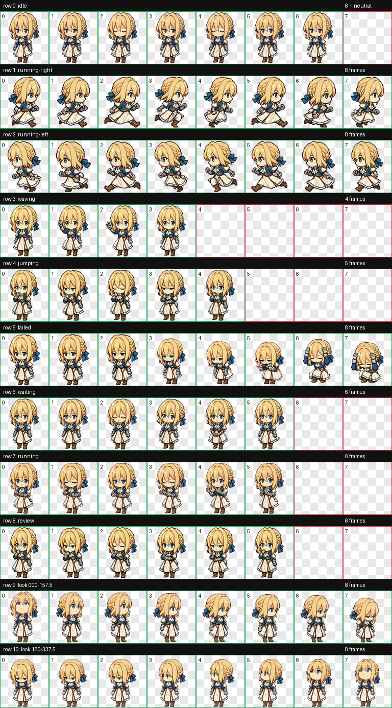
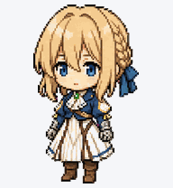

# Violet for Codex

Violet 是一个适用于 Codex Desktop 的 v2 动画宠物。该版本在原有 Violet 基础上补全并优化了 8×11 精灵图集，同时加入安静的自主张望待机循环。



## 本版本特性

- 六帧自主待机：正视、眼睛轻微左看、眨眼回正、眼睛轻微右看、眨眼、恢复正视。
- 待机帧重新采用原始干净头发轮廓，仅在眼睛内部移动注视像素，消除发丝描边的紫色重影和双边缘。
- 鼠标悬停不再跳起，改为较安静的 review / 思考动作。
- 修复失败动作末尾两帧的头部比例与抱头蹲下造型。
- 校正 failed 第 3、4、5 帧的逐帧放大问题，使站立、低头、下蹲到抱头的比例连续。
- 修复 failed 第 3、4、5 帧透明叠加时残留旧版大比例人物所产生的下蹲重影。
- 保留 16 个方向的张望素材以及其余任务状态动画。
- v2 精灵图规格：1536×2288、8 列 × 11 行、单格 192×208。




## 安装

将仓库中的 `pet.json` 和 `spritesheet.webp` 复制到：

```text
%USERPROFILE%\.codex\pets\violet\
```

PowerShell 示例：

```powershell
git clone https://github.com/ChenKai22567/codex_pet_violet.git
$violetTarget = Join-Path $env:USERPROFILE '.codex\pets\violet'
New-Item -ItemType Directory -Force -Path $violetTarget | Out-Null
Copy-Item .\codex_pet_violet\pet.json, .\codex_pet_violet\spritesheet.webp -Destination $violetTarget -Force
```

复制完成后，重启 Codex Desktop，或在 Settings → Pets 中切换一次宠物以刷新缓存，然后选择 Violet。

## 关于张望交互

当前 Windows 版 Codex Desktop 不会把普通鼠标位置持续传给自定义宠物，因此本仓库保留了完整 16 向素材，同时在待机行内实现平台无关的自主左右张望。即使没有鼠标方向事件，Violet 仍会在空闲状态自然观察四周。

## 图集行映射

| 行 | 状态 | 帧数 |
| --- | --- | ---: |
| 0 | idle（自主张望） | 6 + neutral |
| 1 | running-right | 8 |
| 2 | running-left | 8 |
| 3 | waving | 4 |
| 4 | hover review（兼容 jumping 槽位） | 5 |
| 5 | failed | 8 |
| 6 | waiting | 6 |
| 7 | focused work（兼容 running 槽位） | 6 |
| 8 | review | 6 |
| 9–10 | look directions | 16 |

详细校验结果见 [docs/QA.md](docs/QA.md)。

## 声明

这是一个非商业、粉丝制作的 Codex 宠物项目，与原作品权利方及 OpenAI 无官方隶属或背书关系。Violet Evergarden 相关角色权利归其各自权利方所有。
